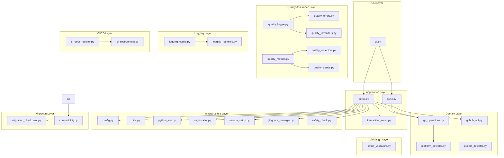
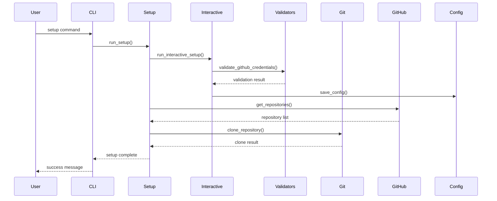
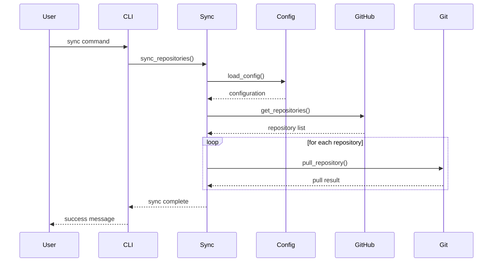
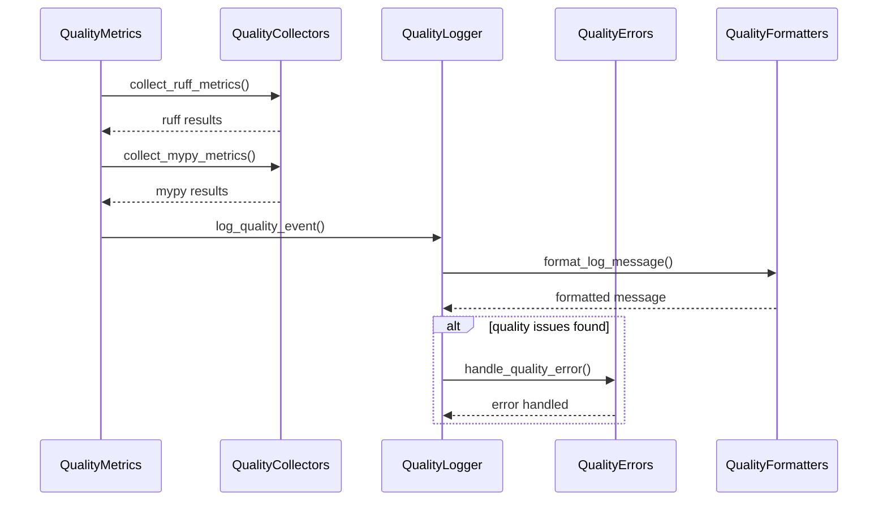

# Setup Repository アーキテクチャドキュメント

## 概要

Setup-Repositoryは、クロスプラットフォーム対応のGitHubリポジトリセットアップ・同期ツールです。このドキュメントでは、リファクタリング後の新しいアーキテクチャについて詳細に説明します。

## アーキテクチャ原則

### 1. 責任分離の原則 (Single Responsibility Principle)

各モジュールは単一の責任を持ち、変更の理由も単一であることを保証します。

### 2. 依存関係逆転の原則 (Dependency Inversion Principle)

高レベルモジュールは低レベルモジュールに依存せず、両方とも抽象に依存します。

### 3. 開放閉鎖の原則 (Open/Closed Principle)

拡張に対して開放的で、修正に対して閉鎖的な設計を採用します。

### 4. インターフェース分離の原則 (Interface Segregation Principle)

クライアントは使用しないインターフェースに依存することを強制されません。

## システム全体構成



## レイヤー別詳細

### CLI Layer (コマンドラインインターフェース層)

#### cli.py

- **責任**: コマンドライン引数の解析とサブコマンドのディスパッチ
- **依存関係**: Application Layer
- **公開インターフェース**:
  - `setup_cli()`: セットアップコマンドの処理
  - `sync_cli()`: 同期コマンドの処理

### Application Layer (アプリケーション層)

#### setup.py

- **責任**: セットアップワークフローのオーケストレーション
- **依存関係**: Domain Layer, Infrastructure Layer
- **公開インターフェース**:
  - `run_setup()`: メインセットアップ処理
  - `validate_setup()`: セットアップ前検証

#### sync.py

- **責任**: リポジトリ同期ワークフローの管理
- **依存関係**: Domain Layer
- **公開インターフェース**:
  - `sync_repositories()`: リポジトリ同期処理
  - `dry_run_sync()`: ドライラン実行

#### interactive_setup.py

- **責任**: インタラクティブセットアップウィザードの提供
- **依存関係**: Validation Layer
- **公開インターフェース**:
  - `run_interactive_setup()`: ウィザード実行
  - `setup_wizard()`: セットアップウィザード
  - `handle_user_input()`: ユーザー入力処理

### Domain Layer (ドメイン層)

#### git_operations.py

- **責任**: Git操作の抽象化
- **依存関係**: Platform Layer
- **公開インターフェース**:
  - `clone_repository()`: リポジトリクローン
  - `pull_repository()`: リポジトリプル
  - `get_repository_status()`: リポジトリ状態取得

#### github_api.py

- **責任**: GitHub API操作の抽象化
- **依存関係**: なし
- **公開インターフェース**:
  - `get_repositories()`: リポジトリ一覧取得
  - `get_repository_info()`: リポジトリ情報取得
  - `validate_credentials()`: 認証情報検証

#### platform_detector.py

- **責任**: プラットフォーム検出とクロスプラットフォーム対応
- **依存関係**: なし
- **公開インターフェース**:
  - `detect_platform()`: プラットフォーム検出
  - `get_platform_info()`: プラットフォーム情報取得

#### project_detector.py

- **責任**: プロジェクト種別の検出
- **依存関係**: なし
- **公開インターフェース**:
  - `detect_project_type()`: プロジェクト種別検出
  - `get_project_config()`: プロジェクト設定取得

### Infrastructure Layer (インフラストラクチャ層)

#### config.py

- **責任**: 設定管理と環境変数処理
- **依存関係**: なし
- **公開インターフェース**:
  - `load_config()`: 設定読み込み
  - `save_config()`: 設定保存
  - `get_config_value()`: 設定値取得

#### utils.py

- **責任**: 汎用ユーティリティ関数
- **依存関係**: なし
- **公開インターフェース**:
  - `ensure_directory()`: ディレクトリ作成
  - `safe_file_operation()`: 安全なファイル操作

#### python_env.py

- **責任**: Python環境管理
- **依存関係**: Platform Layer
- **公開インターフェース**:
  - `create_virtual_env()`: 仮想環境作成
  - `activate_virtual_env()`: 仮想環境アクティベート

#### uv_installer.py

- **責任**: UVパッケージマネージャー統合
- **依存関係**: Platform Layer
- **公開インターフェース**:
  - `ensure_uv()`: UV環境確保
  - `install_dependencies()`: 依存関係インストール

#### vscode_setup.py

- **責任**: VS Code設定管理
- **依存関係**: Platform Layer
- **公開インターフェース**:
  - `setup_vscode_config()`: VS Code設定
  - `apply_platform_template()`: プラットフォーム固有設定

#### gitignore_manager.py

- **責任**: .gitignoreファイル管理
- **依存関係**: なし
- **公開インターフェース**:
  - `generate_gitignore()`: .gitignore生成
  - `merge_gitignore_templates()`: テンプレート統合

#### safety_check.py

- **責任**: セキュリティ検証
- **依存関係**: なし
- **公開インターフェース**:
  - `run_security_scan()`: セキュリティスキャン
  - `validate_dependencies()`: 依存関係検証

### Quality Assurance Layer (品質保証層)

#### quality_logger.py

- **責任**: 品質ログの基本機能
- **依存関係**: Quality Errors, Quality Formatters
- **公開インターフェース**:
  - `setup_quality_logging()`: 品質ログ設定
  - `get_quality_logger()`: 品質ロガー取得
  - `log_quality_event()`: 品質イベントログ

#### quality_errors.py

- **責任**: 品質関連エラー処理
- **依存関係**: なし
- **公開インターフェース**:
  - `QualityError`: 品質エラークラス
  - `QualityWarning`: 品質警告クラス
  - `handle_quality_error()`: 品質エラー処理

#### quality_formatters.py

- **責任**: ログフォーマッター機能
- **依存関係**: なし
- **公開インターフェース**:
  - `ColoredFormatter`: カラーフォーマッター
  - `JSONFormatter`: JSONフォーマッター
  - `format_log_message()`: ログメッセージフォーマット

#### quality_metrics.py

- **責任**: 品質メトリクス計算
- **依存関係**: Quality Collectors
- **公開インターフェース**:
  - `calculate_quality_score()`: 品質スコア計算
  - `get_quality_metrics()`: 品質メトリクス取得
  - `generate_quality_report()`: 品質レポート生成

#### quality_collectors.py

- **責任**: 品質データ収集
- **依存関係**: なし
- **公開インターフェース**:
  - `collect_ruff_metrics()`: Ruffメトリクス収集
  - `collect_mypy_metrics()`: MyPyメトリクス収集
  - `collect_pytest_metrics()`: Pytestメトリクス収集

#### quality_trends.py

- **責任**: 品質トレンド分析
- **依存関係**: Quality Metrics
- **公開インターフェース**:
  - `analyze_quality_trends()`: 品質トレンド分析
  - `generate_trend_report()`: トレンドレポート生成

### Logging Layer (ログ層)

#### logging_config.py

- **責任**: ログ設定の基本機能
- **依存関係**: Logging Handlers
- **公開インターフェース**:
  - `setup_logging()`: ログ設定初期化
  - `get_log_config()`: ログ設定取得
  - `configure_environment_logging()`: 環境別ログ設定

#### logging_handlers.py

- **責任**: カスタムログハンドラー
- **依存関係**: なし
- **公開インターフェース**:
  - `TeeHandler`: 複数出力ハンドラー
  - `ColoredConsoleHandler`: カラーコンソールハンドラー
  - `create_file_handler()`: ファイルハンドラー作成

### CI/CD Layer (CI/CD層)

#### ci_environment.py

- **責任**: CI環境検出
- **依存関係**: なし
- **公開インターフェース**:
  - `detect_ci_environment()`: CI環境検出
  - `get_system_info()`: システム情報取得
  - `is_ci_environment()`: CI環境判定

#### ci_error_handler.py

- **責任**: CIエラーハンドリング
- **依存関係**: CI Environment
- **公開インターフェース**:
  - `handle_ci_error()`: CIエラー処理
  - `generate_error_report()`: エラーレポート生成
  - `send_notification()`: 通知送信

### Validation Layer (検証層)

#### setup_validators.py

- **責任**: セットアップ入力検証
- **依存関係**: なし
- **公開インターフェース**:
  - `validate_github_credentials()`: GitHub認証情報検証
  - `validate_directory_path()`: ディレクトリパス検証
  - `check_system_requirements()`: システム要件チェック

### Migration Layer (移行層)

#### migration_checkpoint.py

- **責任**: 移行チェックポイント管理
- **依存関係**: なし
- **公開インターフェース**:
  - `MigrationCheckpoint`: チェックポイント管理クラス
  - `create_checkpoint()`: チェックポイント作成
  - `rollback_to_checkpoint()`: ロールバック実行

#### compatibility.py

- **責任**: 後方互換性維持
- **依存関係**: 全モジュール
- **公開インターフェース**:
  - `create_compatibility_aliases()`: 互換性エイリアス作成
  - `show_migration_guide()`: 移行ガイド表示

## データフロー

### セットアップフロー



### 同期フロー



### 品質チェックフロー



## 設計パターン

### 1. Factory Pattern

プラットフォーム固有の実装を生成するために使用：

```python
class PlatformFactory:
    @staticmethod
    def create_installer(platform: str) -> PackageInstaller:
        if platform == "windows":
            return ScoopInstaller()
        elif platform == "linux":
            return SnapInstaller()
        elif platform == "macos":
            return HomebrewInstaller()
```

### 2. Strategy Pattern

異なる品質ツールの実行戦略に使用：

```python
class QualityCheckStrategy:
    def execute(self) -> QualityResult:
        raise NotImplementedError

class RuffStrategy(QualityCheckStrategy):
    def execute(self) -> QualityResult:
        # Ruff実行ロジック
        pass
```

### 3. Observer Pattern

品質メトリクスの変更通知に使用：

```python
class QualityObserver:
    def update(self, metrics: QualityMetrics) -> None:
        raise NotImplementedError

class QualityTrendObserver(QualityObserver):
    def update(self, metrics: QualityMetrics) -> None:
        # トレンド分析更新
        pass
```

### 4. Command Pattern

CLI操作の実装に使用：

```python
class Command:
    def execute(self) -> None:
        raise NotImplementedError

class SetupCommand(Command):
    def execute(self) -> None:
        # セットアップ実行
        pass
```

### 5. Template Method Pattern

セットアップワークフローの共通構造に使用：

```python
class SetupTemplate:
    def setup(self) -> None:
        self.validate_prerequisites()
        self.configure_environment()
        self.install_dependencies()
        self.finalize_setup()
    
    def validate_prerequisites(self) -> None:
        # 共通前提条件チェック
        pass
    
    def configure_environment(self) -> None:
        raise NotImplementedError  # サブクラスで実装
```

## エラーハンドリング戦略

### 1. 階層化エラー処理

```python
# 基底例外クラス
class SetupRepositoryError(Exception):
    """Setup Repository基底例外"""
    pass

# ドメイン固有例外
class GitOperationError(SetupRepositoryError):
    """Git操作エラー"""
    pass

class GitHubAPIError(SetupRepositoryError):
    """GitHub APIエラー"""
    pass

class QualityError(SetupRepositoryError):
    """品質チェックエラー"""
    pass
```

### 2. エラー回復戦略

- **Retry Pattern**: 一時的な失敗に対する再試行
- **Circuit Breaker Pattern**: 連続失敗時の回路遮断
- **Fallback Pattern**: 代替手段の提供

### 3. エラーログ戦略

- 構造化ログによる詳細情報記録
- エラーレベルに応じた通知
- トレーサビリティの確保

## セキュリティ考慮事項

### 1. 認証情報管理

- 環境変数による認証情報管理
- 設定ファイルでの平文保存回避
- 一時的な認証情報の安全な削除

### 2. ファイルシステムセキュリティ

- 適切なファイル権限設定
- 一時ファイルの安全な処理
- パストラバーサル攻撃の防止

### 3. ネットワークセキュリティ

- HTTPS通信の強制
- 証明書検証の実施
- タイムアウト設定による DoS 防止

## パフォーマンス考慮事項

### 1. 並行処理

- 複数リポジトリの並行同期
- 非同期I/O操作の活用
- スレッドプールによるリソース管理

### 2. キャッシュ戦略

- GitHub API レスポンスのキャッシュ
- 設定情報のメモリキャッシュ
- ファイルシステムキャッシュの活用

### 3. リソース最適化

- メモリ使用量の監視
- 大量データの段階的処理
- 不要なオブジェクトの早期解放

## 拡張性設計

### 1. プラグインアーキテクチャ

新しいプラットフォームや品質ツールの追加を容易にする設計：

```python
class Plugin:
    def initialize(self) -> None:
        pass
    
    def execute(self) -> None:
        pass

class PluginManager:
    def register_plugin(self, plugin: Plugin) -> None:
        pass
    
    def execute_plugins(self) -> None:
        pass
```

### 2. 設定駆動アーキテクチャ

設定ファイルによる動作カスタマイズ：

```json
{
  "platforms": {
    "windows": {
      "package_manager": "scoop",
      "shell": "powershell"
    }
  },
  "quality_tools": {
    "enabled": ["ruff", "mypy", "pytest"],
    "thresholds": {
      "coverage": 80
    }
  }
}
```

### 3. イベント駆動アーキテクチャ

疎結合なコンポーネント間通信：

```python
class EventBus:
    def publish(self, event: Event) -> None:
        pass
    
    def subscribe(self, event_type: str, handler: Callable) -> None:
        pass
```

## 監視・運用

### 1. ログ戦略

- 構造化ログ（JSON形式）
- ログレベルの適切な設定
- ログローテーション

### 2. メトリクス収集

- 実行時間の測定
- エラー率の監視
- リソース使用量の追跡

### 3. ヘルスチェック

- システム依存関係の確認
- 外部サービスの可用性チェック
- 設定の妥当性検証

## 今後の発展

### 1. マイクロサービス化

大規模環境での利用を想定したサービス分割：

- セットアップサービス
- 同期サービス
- 品質チェックサービス

### 2. Web UI の追加

コマンドライン以外のインターフェース：

- ダッシュボード機能
- 設定管理UI
- 品質レポート表示

### 3. クラウド統合

クラウドサービスとの連携：

- CI/CD パイプライン統合
- クラウドストレージ連携
- 通知サービス統合

## まとめ

新しいアーキテクチャは以下の特徴を持ちます：

1. **明確な責任分離**: 各モジュールが単一の責任を持つ
2. **高い拡張性**: 新機能の追加が容易
3. **優れた保守性**: コードの理解と修正が簡単
4. **堅牢なエラーハンドリング**: 適切な例外処理とエラー回復
5. **包括的なテスト**: 高いテストカバレッジによる品質保証

このアーキテクチャにより、Setup-Repositoryは長期的な保守性と拡張性を確保し、継続的な改善が可能になります。
