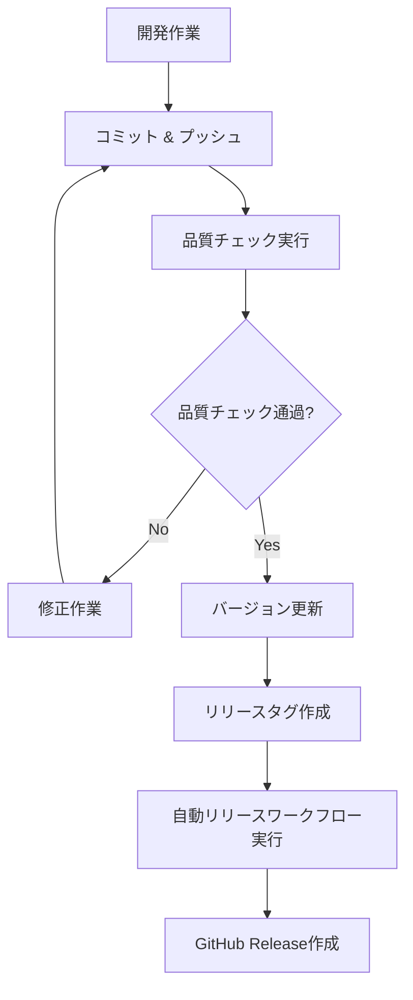

# 🚀 リリース管理ガイド

Setup Repositoryプロジェクトの自動リリース管理システムの使用方法とワークフローについて説明します。

## 📋 概要

このプロジェクトでは以下の自動化されたリリース管理システムを採用しています：

- **タグベースの自動リリース**: セマンティックバージョンタグでリリースをトリガー
- **CHANGELOG.mdの自動更新**: コミット履歴から変更内容を自動生成
- **バージョン番号の一貫性チェック**: 複数ファイル間でのバージョン同期
- **GitHub Releasesの自動作成**: アセット添付とリリースノート生成

## 🔧 リリースワークフロー

### 1. 開発からリリースまでの流れ



### 2. 手動リリース手順

#### ステップ1: 品質チェック
```bash
# 全品質チェックを実行
make quality-gate

# または個別実行
make test
make coverage-check
uv run ruff check .
uv run basedpyright src/
```

#### ステップ2: バージョン管理
```bash
# 現在のバージョン確認
make version-check

# バージョンの自動インクリメント
make version-bump TYPE=patch    # 1.0.0 → 1.0.1
make version-bump TYPE=minor    # 1.0.0 → 1.1.0
make version-bump TYPE=major    # 1.0.0 → 2.0.0
make version-bump TYPE=prerelease  # 1.0.0 → 1.0.1-beta.1

# または手動でバージョン設定
uv run python scripts/version-manager.py --set 1.2.0
```

#### ステップ3: リリースタグ作成とプッシュ
```bash
# 変更をコミット
git add .
git commit -m "🚀 Release v1.2.0"

# タグ作成（バージョン管理スクリプトで自動化可能）
git tag -a v1.2.0 -m "Release v1.2.0"

# メインブランチとタグをプッシュ
git push origin main
git push origin v1.2.0
```

### 3. 自動リリース（推奨）

```bash
# ワンコマンドでリリース準備
make release

# バージョンアップとタグ作成を同時実行
uv run python scripts/version-manager.py --bump patch --tag --push
```

## 🏷️ バージョニング規則

### セマンティックバージョニング

このプロジェクトは[セマンティックバージョニング](https://semver.org/lang/ja/)に従います：

- **MAJOR** (1.0.0 → 2.0.0): 互換性のない変更
- **MINOR** (1.0.0 → 1.1.0): 後方互換性のある機能追加
- **PATCH** (1.0.0 → 1.0.1): 後方互換性のあるバグ修正

### プレリリース版

- **Alpha**: `1.0.0-alpha.1` - 初期開発版
- **Beta**: `1.0.0-beta.1` - 機能完成、テスト中
- **RC**: `1.0.0-rc.1` - リリース候補

### バージョン管理対象ファイル

以下のファイルでバージョン番号の一貫性が自動チェックされます：

- `pyproject.toml` - プロジェクトメタデータ
- `src/setup_repo/__init__.py` - パッケージバージョン

## 📝 CHANGELOG管理

### 自動生成ルール

CHANGELOG.mdは以下のルールでコミット履歴から自動生成されます：

#### コミットメッセージのカテゴリ分類

| コミットプレフィックス | CHANGELOGカテゴリ | 例 |
|---|---|---|
| `feat:`, `add:`, `new:` | ✨ 追加 | `feat: 新しい同期機能を追加` |
| `fix:`, `bug:` | 🐛 修正 | `fix: プラットフォーム検出のバグを修正` |
| `change:`, `update:`, `modify:` | 🔄 変更 | `change: 設定ファイル形式を更新` |
| `remove:`, `delete:` | 🗑️ 削除 | `remove: 非推奨APIを削除` |
| `doc:`, `docs:` | 📚 ドキュメント | `docs: READMEを更新` |
| その他 | 🔧 その他 | `refactor: コード構造を改善` |

#### 手動CHANGELOG編集

自動生成されたCHANGELOGは必要に応じて手動で編集できます：

```markdown
## [1.2.0] - 2025-01-15

### ✨ 追加
- 🚀 新しいクロスプラットフォーム同期機能
- 🔧 自動設定検出機能の改善

### 🐛 修正
- Windows環境でのパス処理問題を解決
- GitHub API認証エラーの修正

### 🔄 変更
- 設定ファイル形式をJSONからTOMLに変更
- ログ出力形式の改善
```

## 🤖 GitHub Actions ワークフロー

### リリースワークフローの構成

`.github/workflows/release.yml`は以下のジョブで構成されています：

1. **version-consistency-check**: バージョン一貫性チェック
2. **quality-check**: 品質チェック（既存CIワークフローを再利用）
3. **update-changelog**: CHANGELOG.mdの自動更新
4. **create-github-release**: GitHub Releasesの作成
5. **post-release**: リリース後処理とメトリクス記録

### トリガー条件

- **自動トリガー**: `v*.*.*`形式のタグがプッシュされた時
- **手動トリガー**: GitHub ActionsのUIから実行可能

### 必要な権限

リリースワークフローには以下の権限が必要です：

```yaml
permissions:
  contents: write    # リリース作成とファイル更新
  actions: read      # ワークフロー実行
  checks: write      # チェック結果の書き込み
```

## 🔍 品質ゲート

リリース前に以下の品質チェックが自動実行されます：

### 必須チェック項目

- ✅ **Ruffリンティング**: コードスタイルとエラーチェック
- ✅ **BasedPyright型チェック**: 型安全性の検証
- ✅ **Pytestテスト**: 全テストケースの実行
- ✅ **カバレッジチェック**: 最低80%のコードカバレッジ
- ✅ **セキュリティスキャン**: 脆弱性の検出
- ✅ **バージョン一貫性**: 複数ファイル間のバージョン同期

### 品質ゲート失敗時の対応

品質チェックが失敗した場合：

1. **エラーログを確認**: GitHub ActionsまたはローカルでのMake実行結果
2. **問題を修正**: コード、テスト、設定の修正
3. **再実行**: 修正後に品質チェックを再実行
4. **リリース再試行**: 全チェック通過後にリリースプロセスを再実行

## 📦 アセット管理

### 自動生成されるアセット

GitHub Releasesには以下のファイルが自動添付されます：

- `dist/*.whl` - Pythonホイールパッケージ
- `dist/*.tar.gz` - ソース配布パッケージ
- `CHANGELOG.md` - 変更履歴
- `README.md` - プロジェクト説明
- `LICENSE` - ライセンス情報

### カスタムアセット追加

追加のアセットを含める場合は、`.github/workflows/release.yml`の以下の部分を編集：

```yaml
files: |
  dist/*
  CHANGELOG.md
  README.md
  LICENSE
  docs/setup-guide.md  # 追加例
```

## 🚨 トラブルシューティング

### よくある問題と解決方法

#### 1. バージョン不整合エラー

```bash
❌ バージョン不整合が検出されました:
  - pyproject.toml: 1.0.0
  - __init__.py: 0.9.0
```

**解決方法**:
```bash
# バージョンを統一
uv run python scripts/version-manager.py --set 1.0.0
```

#### 2. 品質チェック失敗

```bash
❌ 品質チェック失敗: BasedPyright型チェックエラー
```

**解決方法**:
```bash
# 個別に問題を確認・修正
uv run basedpyright src/
# 修正後に再実行
make quality-gate
```

#### 3. CHANGELOG生成失敗

```bash
❌ 新しいコミットが見つかりません
```

**解決方法**:
- コミット履歴を確認: `git log --oneline`
- 前回のタグを確認: `git tag -l`
- 必要に応じて手動でCHANGELOGを編集

#### 4. GitHub Release作成失敗

**考えられる原因**:
- GitHub tokenの権限不足
- 同名のリリースが既に存在
- アセットファイルの生成失敗

**解決方法**:
- GitHub Actionsのログを確認
- 必要に応じて手動でリリースを削除・再作成

## 📚 関連ドキュメント

- [CONTRIBUTING.md](../CONTRIBUTING.md) - 開発貢献ガイド
- [setup-guide.md](setup-guide.md) - セットアップガイド
- [GitHub Actions Documentation](https://docs.github.com/en/actions)
- [Semantic Versioning](https://semver.org/lang/ja/)

## 🔄 継続的改善

リリース管理システムは継続的に改善されます：

- **メトリクス収集**: リリース頻度、品質指標の追跡
- **プロセス最適化**: ワークフローの効率化
- **自動化拡張**: より多くの手動作業の自動化
- **品質向上**: より厳格な品質ゲートの導入
