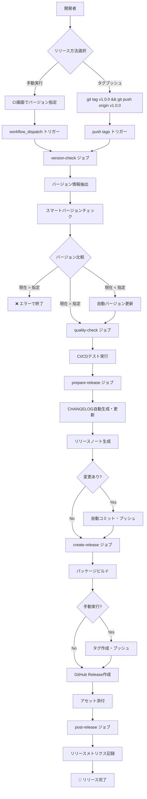
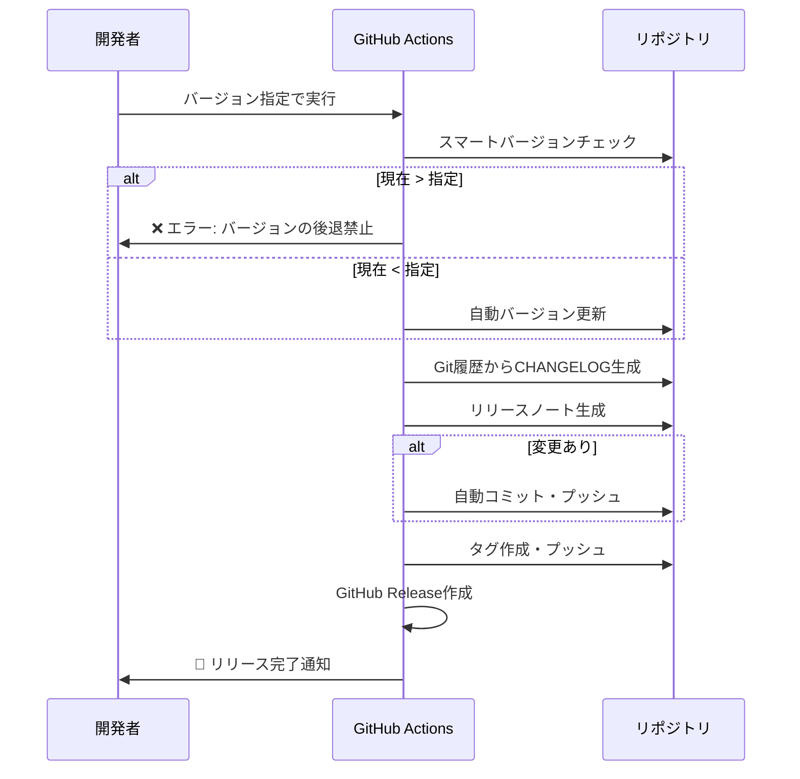
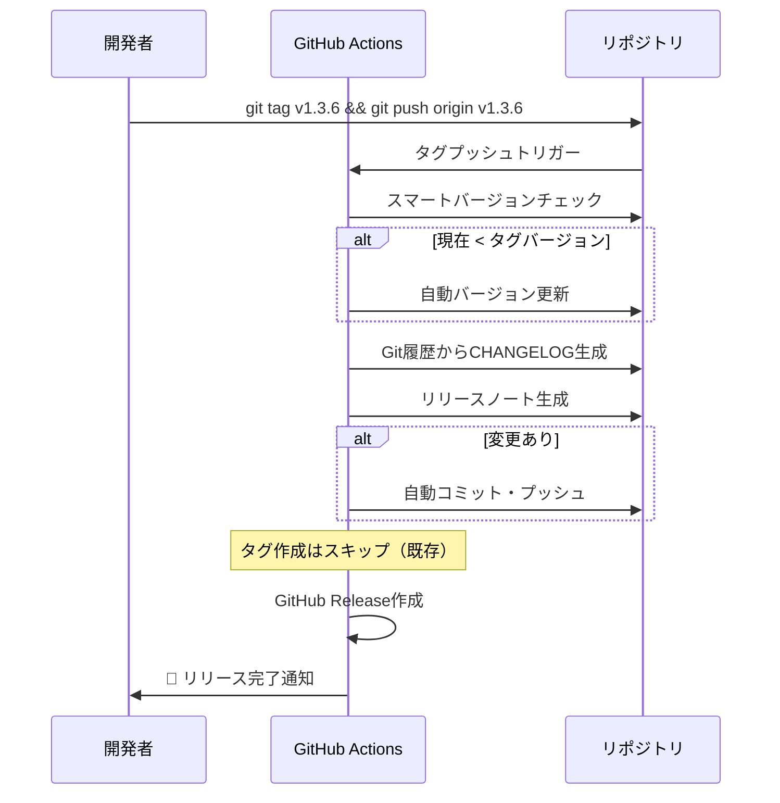
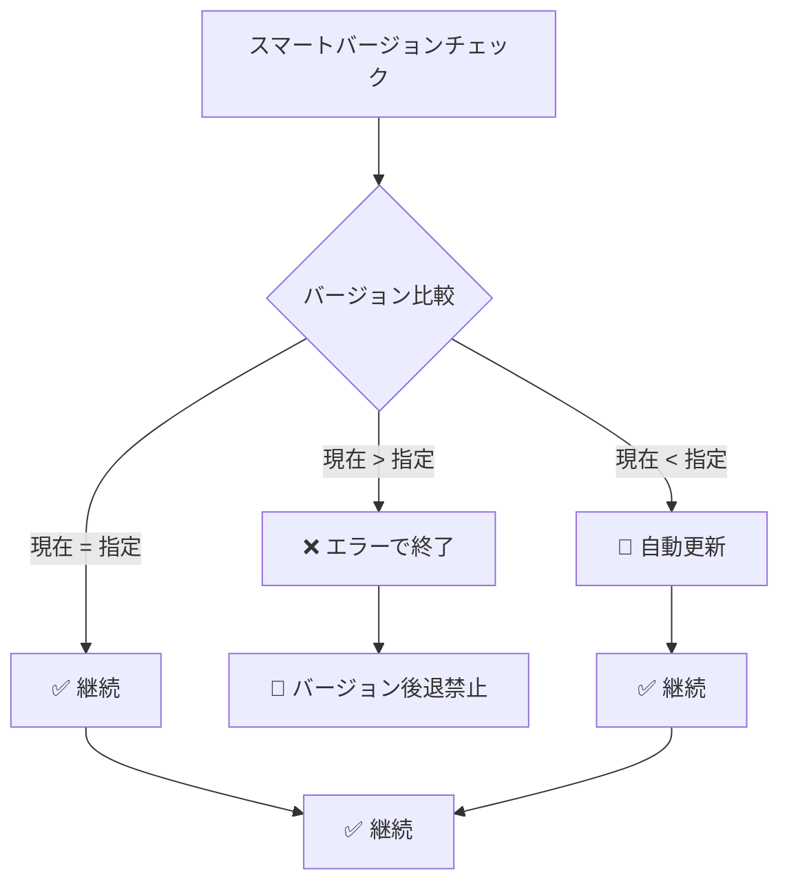

# 🚀 リリースワークフロー完全ガイド

## 📋 概要

このドキュメントでは、Setup Repositoryプロジェクトの完全自動化リリースワークフローについて詳しく説明します。

## 🎯 リリースフローの特徴

- **完全自動化**: ワンクリックで全工程自動実行
- **2つのトリガー**: 手動実行とタグプッシュ
- **自動補完**: 不足部分の自動生成・修正
- **重複回避**: 既存エントリは保持・日付のみ更新
- **Git履歴ベース**: Conventional Commitsから自動CHANGELOG生成

## 🔄 フローチャート



## 🚀 手動リリース（推奨）

### 使用方法

1. **GitHub Actions画面**に移動
2. **🚀 Release Management**ワークフローを選択
3. **「Run workflow」**をクリック
4. **パラメータ入力**:
   - `version`: リリースバージョン (例: 1.3.6)
   - `prerelease`: プレリリースフラグ (true/false)
5. **「Run workflow」**で実行

### 処理フロー



## 🏷️ タグプッシュリリース

### 使用方法

```bash
# ローカルでタグ作成・プッシュ
git tag v1.3.6
git push origin v1.3.6
```

### 処理フロー



## 🔧 ジョブ詳細

### 1. version-check ジョブ

**目的**: スマートバージョンチェックと自動更新

**処理内容**:
- トリガー種別の判定（手動 or タグプッシュ）
- バージョン情報の抽出
- プレリリースフラグの判定
- **スマートバージョンチェック**:
  - 現在 > 指定: エラーで終了
  - 現在 = 指定: 継続
  - 現在 < 指定: 自動更新

**出力**:
- `version`: 対象バージョン
- `is-prerelease`: プレリリースフラグ

### 2. quality-check ジョブ

**目的**: コード品質とテストの実行

**処理内容**:
- CI/CDワークフロー（ci.yml）の実行
- リンティング、型チェック、テスト実行
- セキュリティスキャン

### 3. prepare-release ジョブ

**目的**: リリース準備とドキュメント生成

**処理内容**:
1. **CHANGELOG自動生成・更新**
   - Git履歴からConventional Commitsを解析
   - カテゴリ別に変更内容を分類
   - 既存エントリがあれば日付のみ更新
2. **リリースノート生成**
   - CHANGELOGから該当バージョンを抽出
   - GitHub Release用のマークダウン生成
3. **自動コミット**
   - 変更があれば自動コミット・プッシュ

> **注意**: バージョン更新はversion-checkジョブで完了済み

**出力**:
- `changes-made`: 変更有無フラグ

### 4. create-release ジョブ

**目的**: タグ作成とGitHub Release作成

**処理内容**:
1. **パッケージビルド**
   - Python wheelとtarballの生成
2. **タグ作成（条件付き）**
   - 手動実行時のみタグ作成・プッシュ
   - タグプッシュ時はスキップ
3. **GitHub Release作成**
   - リリースノートを使用
   - アセット添付（dist/, CHANGELOG.md, README.md, LICENSE）

### 5. post-release ジョブ

**目的**: リリース後処理とメトリクス記録

**処理内容**:
- リリースメトリクスの記録
- 成功通知

## 🤖 スマートバージョンチェック

### バージョン比較ロジック

リリースワークフローの最初に実行されるスマートチェック機能：



### 具体例

| 現在バージョン | 指定バージョン | 動作 | 結果 |
|---|---|---|---|
| 1.3.5 | 1.4.0 | 自動更新 | ✅ 1.3.5 → 1.4.0 |
| 1.4.0 | 1.4.0 | 継続 | ✅ 更新不要 |
| 1.5.0 | 1.4.0 | エラー | ❌ バージョン後退禁止 |
| 2.0.0 | 1.9.0 | エラー | ❌ バージョン後退禁止 |

### セキュリティ機能

- **バージョン後退禁止**: セキュリティ上の理由でダウングレードを禁止
- **自動アップグレード**: 安全なバージョンアップのみ許可
- **一貫性保証**: pyproject.tomlと__init__.pyの同期更新

## 🤖 自動CHANGELOG生成

### Conventional Commits対応

以下のコミット形式を自動認識：

- `feat:` → ✨ 新機能
- `fix:` → 🐛 修正
- `docs:` → 📝 ドキュメント
- `refactor:` → 🔄 変更
- その他 → 🔧 その他

### 生成例

```markdown
## [1.3.6] - 2025-01-15

### ✨ 新機能
- 完全自動化リリースフロー実装
- Git履歴ベースのCHANGELOG生成

### 🐛 修正
- YAML構文エラー修正
- バージョン整合性チェック改善

### 🔄 変更
- リリースワークフローの最適化
- ドキュメント構造の改善
```

## 🎯 使い分けガイド

### 手動リリース（推奨）

**適用場面**:
- 定期リリース
- 機能リリース
- 緊急修正リリース

**メリット**:
- CI画面で簡単実行
- バージョン指定が明確
- プレリリースフラグ制御可能

### タグプッシュリリース

**適用場面**:
- ローカル開発環境からのリリース
- スクリプト自動化
- 既存ワークフローとの連携

**メリット**:
- コマンドライン完結
- 既存のGitワークフローと統合
- 自動化スクリプトに組み込み可能

## 🔍 トラブルシューティング

### よくある問題

1. **「Run workflow」ボタンが表示されない**
   - YAML構文エラーの可能性
   - mainブランチにプッシュされているか確認

2. **バージョン後退エラー**
   - 現在のバージョンが指定バージョンより進んでいる
   - 解決: 指定バージョンを現在より大きくする
   - 例: 現在 1.5.0 → 指定 1.6.0 以上

3. **バージョン整合性エラー**
   - スマートチェック機能により自動解決
   - 手動修正が必要な場合はログを確認

3. **CHANGELOG生成が空**
   - Git履歴にConventional Commitsがない
   - フォールバック機能により最小限の内容を生成

4. **タグが重複**
   - 既存タグの確認
   - 手動削除後に再実行

### デバッグ方法

1. **ワークフローログの確認**
   - GitHub Actions画面でログ詳細を確認
   - 各ジョブの実行結果をチェック

2. **ローカルでのテスト**
   ```bash
   # バージョン管理スクリプトのテスト
   uv run python scripts/version-manager.py --check
   uv run python scripts/version-manager.py --smart-check 1.3.6
   uv run python scripts/version-manager.py --update-changelog 1.3.6
   ```

3. **YAML構文チェック**
   ```bash
   # ローカルでYAML構文確認
   uv run python -c "import yaml; yaml.safe_load(open('.github/workflows/release.yml'))"
   ```

## 📚 関連ドキュメント

- [バージョン管理ガイド](version-management.md)
- [CI/CDパイプライン](ci-cd-pipeline.md)
- [開発者ガイド](../README.md#開発・テスト)
- [品質管理システム](quality-management.md)
